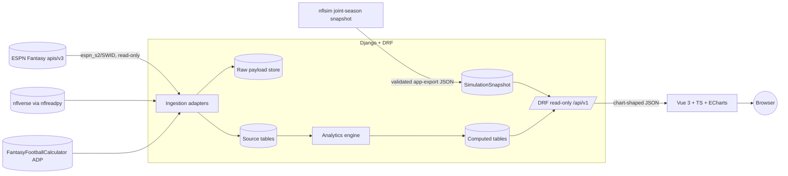
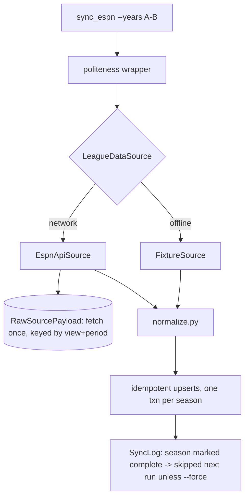
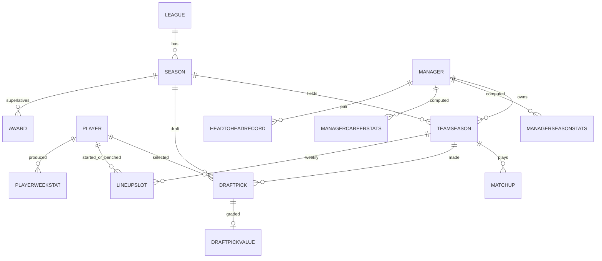

# ARCHITECTURE

## System context



Persist-first: ESPN is hit only during explicit sync runs; all app reads come from PostgreSQL.
Expensive analytics are precomputed at sync time into dedicated tables; API requests are indexed
lookups shaped for charts.

## Backend architecture

Django modular monolith, single app `league/`, split into internal packages:

```
backend/
  config/                 Django project (settings via env, urls, wsgi/asgi)
  league/
    models/               core.py  events.py  context.py  computed.py  provenance.py
    ingestion/
      ports.py            LeagueDataSource Protocol + SeasonRef/EraCapabilities dataclasses
      espn_source.py      EspnApiSource (wraps espn-api) + raw-requests fallback
      fixture_source.py   FixtureSource (saved JSON / synthetic league) — credential-free
      nfl_context.py      nflreadpy + FFC ADP loaders
      politeness.py       serialized request wrapper: jitter, backoff, Retry-After
      normalize.py        raw ESPN payload -> normalized dicts (models never see raw shape)
    analytics/
      frames.py           load DB -> pandas frames ONCE per compute run
      records.py luck.py h2h.py lineups.py drafts.py trends.py awards.py
      engine.py           orchestrates modules, bulk-writes computed tables
    api/                  serializers.py  views.py  urls.py   (read-only, /api/v1/)
    management/commands/  sync_espn  sync_nfl_context  compute_analytics  full_sync  load_fixtures
    tests/                fixtures + unit/contract/identity/malformed tests
```

Business logic lives in `analytics/` and `ingestion/` services — **not** in views or
serializers. Views are thin readers over computed tables.

### Ingestion pipeline



- **Adapter port** (`LeagueDataSource` Protocol) isolates all ESPN specifics; a fixture
  implementation backs tests and credential-free dev. An upstream ESPN break is a one-file fix.
- **Era-aware capabilities** gate calls that would fail (box scores/activity < 2019).
- **Idempotent** upserts keyed on natural keys; `bulk_create(update_conflicts=True)` for the
  high-volume `LineupSlot` rows. One `transaction.atomic()` per season.
- **Incremental:** completed seasons with a successful `SyncLog` are skipped unless `--force`;
  `--current-only` re-syncs just the active season (seconds).

### Analytics pipeline

`frames.py` loads ~6 DataFrames from the DB **once** (matchups, lineup slots, draft picks,
team-seasons, player-week stats, ADP). Each metric module receives the frames — nothing
re-queries. Outputs are collected and bulk-inserted into computed tables via a
**truncate-and-rebuild** (computed tables are pure derivations — always safe to rebuild).
Complexity O(seasons × weeks × teams) with vectorized groupbys → sub-second at league scale.
`compute_analytics` bumps a cache-version key at the end.

pandas is confined to `analytics/` — the request path never imports it.

### Simulation snapshot bridge

`nflsim app-export` is the repository boundary. Its schema-versioned JSON contains player
distributions, season-specific replacement outcomes, conditional injury leverage, weekly
schedule effects, and pairwise tail dependence computed from the same simulated worlds. The
`import_nflsim` management command rejects unknown schemas, non-finite JSON, incomplete
provenance, and duplicate player identities before atomically replacing the matching
season/scoring/team-count snapshot.

The request path selects only a snapshot whose team count matches the draft room. The 4 MB-class
payload is compiled into normalized player and pair lookups once per process and keyed by content
checksum, so a newly imported artifact invalidates naturally. No simulation claim is synthesized
when a matching snapshot is unavailable.

## Frontend architecture

Vue 3 + Vite + TypeScript, Pinia (stores per domain: league, managers, seasons, trends),
Vue Router, **Apache ECharts via `vue-echarts`** (per-chart module imports for a small bundle).

```
frontend/src/
  api/client.ts        typed fetch wrappers over /api/v1
  stores/              pinia stores
  charts/              ECharts option builders (one per chart type; consistent palette)
  components/          StatTile, RecordTable, AwardCard, ManagerBadge, ...
  views/               HomeView SeasonView ManagerView RivalriesView DraftsView TrendsView HallOfFameView
  router/
```

- Every chart endpoint returns **ECharts-ready shape** (`{labels, series:[{name,data}]}`) built
  server-side; the frontend never aggregates.
- **Manager color system:** each manager gets a stable color across every page/chart (follows the
  `dataviz` skill palette guidance; accessible in light & dark).
- Dev: Vite proxies `/api` → `:8000`. Prod (optional): `vite build` served by Django (WhiteNoise)
  = single process.

## Database model



- **Source tables:** `League`, `Season` (per-year scoring/roster settings JSON,
  `lineups_available` flag), `Manager` (**stable SWID GUID — cross-season identity anchor**,
  admin-editable alias), `TeamSeason` (unique `(season, espn_team_id)`, co-owner M2M),
  `Player` (+ nullable `gsis_id` crosswalk), `Matchup` (typed REG/PLAYOFF/CONSOLATION/
  CHAMPIONSHIP/TOILET_BOWL), `DraftPick`, `LineupSlot` (team-week-player-slot-points — the
  workhorse for bench/optimal analytics), `Transaction` (best-effort), `SyncLog`/`IngestionRun`,
  `RawSourcePayload` (provenance).
- **Context tables:** `PlayerWeekStat` (nflverse weekly), `PlayerADP`.
- **Computed tables** (rebuilt by `compute_analytics`): `ManagerSeasonStats`,
  `ManagerCareerStats`, `HeadToHeadRecord`, `DraftPickValue`, `SeasonTrend` (chart-shaped JSON),
  `Award` (slug + winner + `context` JSON).

**Manager identity** (the differentiator): `Manager` keyed on SWID GUID survives team renames,
display-name changes, and co-ownership (M2M). Admin can merge/alias managers whose GUID changed.

**Indexes:** every `unique_together`, plus `Matchup(season, week)`, `LineupSlot(week, slot)`,
`PlayerWeekStat(season, gsis_id)`. Single-digit-ms reads at league scale.

## Caching

Data changes only at sync time, so heavy machinery is unnecessary:
- Precomputed tables ARE the cache; requests are indexed lookups.
- `compute_analytics` bumps a cache-version key; DRF responses carry `Cache-Control` / optional
  `@cache_page` (Django local-memory cache — no Redis).
- **Redis/Celery deferred** until a demonstrated need (see [DECISIONS.md](./DECISIONS.md)).

## Deployment assumptions

Local-first via Docker Compose (postgres + backend + frontend dev). Sync is a manual/cron
management command (`full_sync` Tuesday mornings in season). No cloud services, no paid infra,
no push/deploy without explicit authorization.

## Major tradeoffs

| Decision | Chosen | Rejected | Why |
|---|---|---|---|
| ESPN access | `espn-api` behind adapter + fixtures | hand-rolled JSON parsing | MIT, maintained; adapter contains upstream churn |
| Public stats pkg | `nflreadpy` | `nfl_data_py` | latter is deprecated |
| Compute timing | precompute at sync | per-request | fast reads, no cache infra |
| Background jobs | management commands | Celery/Redis | sync is minutes (backfill) / seconds (weekly) |
| DB | PostgreSQL (SQLite for tests) | — | user-specified; JSONB for settings blobs |
| Charts | ECharts | Chart.js | native heatmaps/boxplots/dataZoom for long time axes |
| pandas scope | analytics only | everywhere | keeps request path lean |
